# GND Reconciliation API mit OpenSearch

Lokaler Docker-basierter Reconciliation-Service für die **Gemeinsame Normdatei (GND)** und Getty-Vokabulare. Der Service lädt die Daten herunter, speichert und indexiert sie lokal in OpenSearch und stellt OpenRefine-kompatible Reconciliation APIs bereit: GND unter der eigenen Service-URL `/gnd` (sowie, aus Gründen der Abwärtskompatibilität, weiterhin am Root-Endpunkt `/`) und Getty (AAT, ULAN, TGN) unter einer einzigen Service-URL `/getty`. Innerhalb von `/getty` wählt man das gewünschte Vokabular über den Type-Filter in OpenRefine ("AAT search", "ULAN search", "TGN search" oder "Search all Vocabs"), ähnlich wie bei GND ein Typ wie "Person" gewählt wird.

**API-Dokumentation (Swagger UI)**: [http://127.0.0.1:8083/docs](http://127.0.0.1:8083/docs) CHANGE!

## 📚 Dokumentation

- **[README.md](README.md)** (dieses Dokument): Schnellstart, Nutzung, API-Referenz
- **[docs/ENTWICKLUNG.md](docs/ENTWICKLUNG.md)**: Entwicklungsumgebung, Code-Qualität, Best Practices
- **[docs/ARCHITEKTUR.md](docs/ARCHITEKTUR.md)**: Architektur, Komponenten und Datenfluss
- **[docs/CONTRIBUTING.md](docs/CONTRIBUTING.md)**: Beitragsrichtlinien für Pull Requests und Commits
- **[docs/CHANGELOG.md](docs/CHANGELOG.md)**: Änderungsprotokoll
- **[.devcontainer/README.md](.devcontainer/README.md)**: DevContainer-Spezifische Dokumentation

## 🔗 Verwandte Projekte

- **[Reconciliation Web UI](https://git.kpool.at/kulturpool/development/ai/microservice-gnd-reconciliation-interface)**: Eigenständige Web-Oberfläche zum Hochladen von CSV/TSV/Excel-Dateien, Zuordnen von Spalten/Properties und Batch-Reconciliation gegen diese API (kein OpenRefine erforderlich).

---

## Features

- Lokale GND-Reconciliation für OpenRefine, erreichbar unter `/gnd` (und weiterhin am Root-Endpunkt `/` für Abwärtskompatibilität)
- Getty-Reconciliation über eine einzige Service-URL (`/getty`) mit Vokabular-Auswahl per Type-Filter (AAT/ULAN/TGN/alle)
- Automatischer Download und Indexaufbau beim ersten Start
- Persistenter lokaler Suchindex in OpenSearch
- OpenRefine-kompatible Reconciliation API
- Batch-Reconciliation über OpenSearch `_msearch` (ein Request pro Batch statt pro Zeile) für schnelle Verarbeitung auch großer Datensätze (40.000+ Zeilen)
- Zusätzliche Properties (z.B. `dateOfBirth`, `dateOfDeath`) verbessern die Trefferqualität, ohne die Suche zu verlangsamen
- Type Suggest, Entity Suggest und Property Suggest
- Extend API für `Add columns from reconciled values`
- Entity Preview inklusive Link zum GND-Datensatz
- EntityFacts-Enrichment, u.a. für `Family`, `sameAs`, `depiction`, `associatedCountry`
- Automatische regelmäßige OAI-Updates ohne vollständigen Reindex
- Docker Compose Runtime Setup
- DevContainer für Entwicklung

---

## Voraussetzungen

Benötigt wird:

- Docker
- Docker Compose
- OpenRefine

Der erste vollständige Import kann je nach Rechner, Netzwerk und Datenstand mehrere Stunden dauern. Spätere Starts sind deutlich schneller, da der Index persistent gespeichert wird.
Der initiale Download des Gesamtabzugs der GND inklusive Enitity Facts beträgt über 3.2GB, und der Index benötigt 25GB Speicherplatz.

---

## Schnellstart

### 1. Repository klonen

```bash
git clone <REPOSITORY_URL>
cd <REPOSITORY_NAME>
```

### 2. Environment-Datei erstellen

```bash
cp .env.example .env
```

Typische Standardwerte:

```env
API_PORT=8083
HOST_API_PORT=8083
PUBLIC_BASE_URL=http://127.0.0.1:8083

OPENSEARCH_HOST=opensearch
OPENSEARCH_PORT=9200

GND_FORCE_REINDEX=false
GND_INDEX_ENTITYFACTS=true
GND_ENTITYFACTS_ONLY_TYPE=

GND_AUTO_UPDATE=true
GND_UPDATE_INTERVAL_HOURS=168
GND_UPDATE_INITIAL_DELAY_SECONDS=300

GND_OAI_BASE_URL=https://services.dnb.de/oai/repository
GND_OAI_METADATA_PREFIX=RDFxml
GND_OAI_SET=authorities
GND_OAI_OVERLAP_MINUTES=60

GND_OAI_REQUEST_TIMEOUT_SECONDS=300
GND_OAI_REQUEST_MAX_RETRIES=6
GND_OAI_REQUEST_BACKOFF_SECONDS=10
GND_OAI_PAGE_DELAY_SECONDS=2
```

### 3. Runtime-Container starten

```bash
docker compose -f docker-compose.runtime.yml up --build
```

Beim ersten Start passiert automatisch:

1. lokale Datenordner werden erstellt
2. GND-LDS-Dumps werden heruntergeladen
3. GND-Daten werden in OpenSearch indexiert
4. EntityFacts werden als Enrichment ergänzt
5. der OAI-Update-Scheduler wird gestartet, falls `GND_AUTO_UPDATE=true`
6. die API startet auf dem konfigurierten Port, standardmäßig `8083`

Wenn der Index bereits existiert und `GND_FORCE_REINDEX=false` gesetzt ist, wird der Full-Import übersprungen und die API direkt gestartet.

---

## Entwicklung vs. Production

Dieses Repository unterstützt **zwei verschiedene Modi**:

### 🏭 Production/Runtime (docker-compose.runtime.yml)

**Verwendung**: Deployment, Production, regelmäßige Nutzung

```bash
docker compose -f docker-compose.runtime.yml up --build
```

**Eigenschaften**:
- ✅ Optimiertes, kleines Docker Image (Multi-Stage Build)
- ✅ Code wird beim Build in das Image kopiert
- ✅ Automatischer Start mit Healthcheck
- ✅ Minimale Dependencies
- ❌ Keine Code-Änderungen ohne Rebuild
- ❌ Keine Entwickler-Tools

**Verwendung für**:
- Produktive Nutzung mit OpenRefine
- Server-Deployment
- Langzeitbetrieb mit automatischen Updates

---

### 🔧 Entwicklung (DevContainer)

**Verwendung**: Lokale Code-Entwicklung mit VS Code

**Voraussetzung**: VS Code mit Extension **Dev Containers** ([ms-vscode-remote.remote-containers](https://marketplace.visualstudio.com/items?itemName=ms-vscode-remote.remote-containers))

**Verwendung**:
1. Repository in VS Code öffnen
2. Command Palette: `Ctrl+Shift+P`
3. `Dev Containers: Reopen in Container`

**Eigenschaften**:
- ✅ Workspace-Ordner live gemountet
- ✅ Code-Änderungen sofort aktiv (Hot Reload)
- ✅ Vorinstallierte VS Code Extensions
- ✅ Entwickler-Tools (vim, httpie, jq, etc.)
- ✅ Integriertes Debugging
- ✅ Python-Linting und Formatting (Ruff)

**Verwendung für**:
- API-Entwicklung
- Testing neuer Features
- Debugging
- Code-Refactoring

---

### 📦 Gemeinsames OpenSearch Volume

**Wichtig**: Beide Modi teilen sich das gleiche OpenSearch-Volume!

**Vorteil**: GND-Index muss nur einmal gebaut werden (~3 GB Download + 25 GB Indexierung)

**Nachteil**: Runtime und DevContainer dürfen **nicht gleichzeitig** laufen

**Wechsel von Runtime zu DevContainer**:
```bash
docker compose -f docker-compose.runtime.yml down
# Dann in VS Code: "Reopen in Container"
```

**Wechsel von DevContainer zu Runtime**:
```bash
# In VS Code: "Reopen Folder Locally"
docker compose -f .devcontainer/docker-compose.yml down
docker compose -f docker-compose.runtime.yml up --build
```

**Details**: Siehe [.devcontainer/README.md](.devcontainer/README.md)

---

## OpenRefine verbinden

In OpenRefine:

```text
Column
→ Reconcile
→ Start reconciling
→ Add Standard Service
```
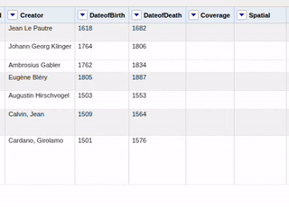 <br>
Service in OpenRefine hinzufügen

Service URL eintragen:

```text
http://127.0.0.1:8083/gnd
```
oder
```text
http://127.0.0.1:8083/getty
```
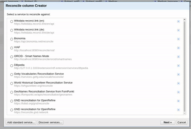<br>
Service URL eintragen

Wichtig: **Nicht** `/reconcile` anhängen.

Richtig:

```text
http://127.0.0.1:8083/gnd
```

Falsch:

```text
http://127.0.0.1:8083/gnd/reconcile
```

Danach kann der Service wie jeder andere OpenRefine-Reconciliation-Service verwendet werden.


---

## Typische Nutzung in OpenRefine

### Reconciliation starten

1. Spalte auswählen, z.B. `name`
2. Reconcile starten
3. lokalen GND-Service auswählen
4. passenden Typ wählen, z.B.:
   - `Normdatenressource`
   - `Individualisierte Person`
   - `Körperschaft`
   - `Konferenz oder Veranstaltung`
   - `Geografikum`
   - `Schlagwort`
   - `Werk`
   - `Familie`

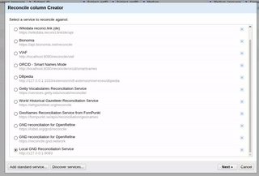<br>
Reconciliation Typen auswählen

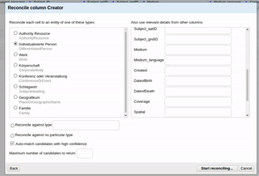<br>
Zusätzliche Properties hinzufügen

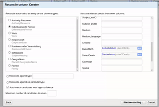 <br>
Die Reconciliation starten

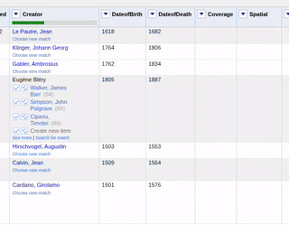<br>
Ergebnisse begutachten

### Zusätzliche Spalten hinzufügen

Nach erfolgreicher Reconciliation:

```text
Edit column
→ Add columns from reconciled values
```
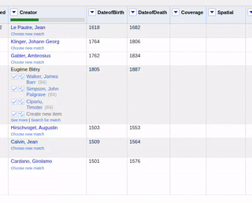<br>
Neue Spalten anhand der Reconciled Values hinzufügen

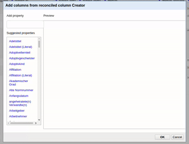<br>
Die neuen Properties auswählen

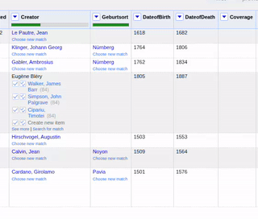<br>
Neue Spalten begutachten


Beispiele für Properties:

- GND-ID
- Bevorzugter Name
- Variantenamen
- Entitätstyp
- Geburtsdatum
- Sterbedatum
- Beruf oder Tätigkeit
- Wirkungsort
- geografische Angaben
- sameAs
- biografische oder historische Informationen
- Bildverweise, falls vorhanden, z.B. `depiction`

Beim Hinzufügen von Properties kann in OpenRefine über **Configure** u.a. gewählt werden:

- Ausgabe als `literal`
- Ausgabe als `id`
- Limit der zurückgegebenen Werte

---

## Bereits vorhandene IDs verwenden

Wenn eine Spalte bereits IDs enthält, kann in OpenRefine verwendet werden:

```text
Reconcile
→ Use values as identifiers
```
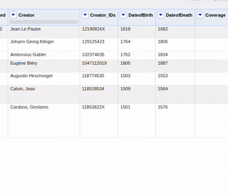<br>
Werte als Identifikatoren verwenden

Beispielwerte:

```text
118540238
118624822
1036893200
```
Hier ist es wichtig dass es je nach Service unterschiedliche Anforderungen gibt.
Während für den /gnd Endpunkt die reine ID ohne prefix gewünscht ist, benötigt der /getty-Endpunkt den jeweiligen /aat, /ulan, oder /tgn Prefix vor der ID.

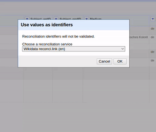<br>
Den richtigen Service auswählen

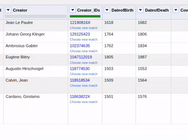<br>
Die Ergebnisse begutachten

Danach können über **Add columns from reconciled values** zusätzliche Informationen aus der lokalen GND ergänzt werden.

---

## API testen

> **Hinweis:** Der GND-Service ist sowohl über den Root-Pfad (`http://localhost:8083/…`, aus Gründen der Abwärtskompatibilität) als auch über den eigenen Präfix `http://localhost:8083/gnd/…` erreichbar — analog zu `/getty` für den Getty-Service. Beide Varianten sind funktional identisch; für neue Integrationen wird `/gnd` empfohlen.

### Service Manifest

```bash
curl http://localhost:8083/
# äquivalent:
curl http://localhost:8083/gnd/
```
und
```bash
curl http://localhost:8083/getty/
```

### Reconciliation

```bash
curl -X POST "http://localhost:8083/" \
  -H "Content-Type: application/x-www-form-urlencoded" \
  --data-urlencode 'queries={"q1":{"query":"Goethe","type":"DifferentiatedPerson"}}'
```

### Extend testen

```bash
curl -X POST "http://localhost:8083/" \
  -H "Content-Type: application/x-www-form-urlencoded" \
  --data-urlencode 'extend={"ids":["118540238"],"properties":[{"id":"preferredName"},{"id":"dateOfBirth"},{"id":"dateOfDeath"}]}'
```

### Preview testen

```bash
curl "http://localhost:8083/preview?id=118540238"
```

### Update-Status testen

```bash
curl "http://localhost:8083/status/update"
```

---

## API-Endpunkte

Der Service implementiert eine OpenRefine-kompatible Reconciliation API. OpenRefine nutzt viele dieser Endpunkte automatisch über das Service Manifest. Die folgenden Beispiele sind vor allem für Tests, Debugging und Integration mit anderen Clients gedacht.

### Service Manifest

```bash
curl "http://localhost:8083/"
```

Liefert das Service Manifest, über das OpenRefine erkennt, welche Funktionen der Service unterstützt.

---

### Reconciliation Query

Standard-Reconciliation über den Root-Endpunkt:

```bash
curl -X POST "http://localhost:8083/" \
  -H "Content-Type: application/x-www-form-urlencoded" \
  --data-urlencode 'queries={"q1":{"query":"Goethe","type":"DifferentiatedPerson"}}'
```

Beispiel für den generischen Typ `AuthorityResource`:

```bash
curl -X POST "http://localhost:8083/" \
  -H "Content-Type: application/x-www-form-urlencoded" \
  --data-urlencode 'queries={"q1":{"query":"Goethe","type":"AuthorityResource"}}'
```

Beispiel für Familien:

```bash
curl -X POST "http://localhost:8083/" \
  -H "Content-Type: application/x-www-form-urlencoded" \
  --data-urlencode 'queries={"q1":{"query":"Acker","type":"Family"}}'
```

Falls ein `/reconcile`-Alias in der API aktiviert ist, kann alternativ auch dieser Endpunkt verwendet werden:

```bash
curl -X POST "http://localhost:8083/reconcile" \
  -H "Content-Type: application/x-www-form-urlencoded" \
  --data-urlencode 'queries={"q1":{"query":"Goethe","type":"DifferentiatedPerson"}}'
```

---

### Reconciliation mit mehreren Queries

```bash
curl -X POST "http://localhost:8083/" \
  -H "Content-Type: application/x-www-form-urlencoded" \
  --data-urlencode 'queries={"q1":{"query":"Goethe","type":"DifferentiatedPerson"},"q2":{"query":"Berlin","type":"PlaceOrGeographicName"}}'
```

---

### Performance & Scoring

Alle Queries eines OpenRefine-Batches werden in einem einzigen OpenSearch `_msearch`-Request verarbeitet (statt eines Requests pro Zeile). Für jeden Kandidaten wird dabei nur eine reduzierte Feldauswahl (`id`, `uri`, `preferredName`, `variantName`, `type`, `dateOfBirth`, `dateOfDeath`, `dateOfBirthAndDeath`, `professionOrOccupation`, `placeOfBirth`, `placeOfDeath`, `propertiesFlat`) aus OpenSearch geladen. Das macht Batches mit vielen Zeilen (z.B. 40.000+ Personen-Datensätze) deutlich schneller als eine sequenzielle Verarbeitung.

Zusätzliche Properties aus anderen OpenRefine-Spalten (insbesondere `dateOfBirth`, `dateOfDeath`) dienen als **unterstützende, zusätzliche Evidenz** und nicht als primäres Kriterium:

- Der Namensabgleich (inkl. normalisierter, GND-typischer invertierter Schreibweise wie `"Goethe, Johann Wolfgang von"` vs. `"Johann Wolfgang von Goethe"`) bestimmt weiterhin den Großteil des Scores.
- Übereinstimmende Properties (z.B. gleiches Geburts-/Sterbejahr, passender Typ) geben einen Bonus, der aber gedeckelt ist: Ein schwacher Namenstreffer kann durch Property-Übereinstimmungen nicht künstlich zu einem automatischen Match (`match: true`) aufgewertet werden.
- Abweichende Properties (z.B. falsches Geburtsjahr) führen zu einem moderaten Score-Abzug; kleine Abweichungen (z.B. ein Jahr Unterschied) werden nicht hart bestraft, da GND-Datumsangaben teils ungenau/fuzzy sind.
- `match: true` wird weiterhin konservativ vergeben: entweder bei eindeutig hohem Score mit ausreichendem Abstand zum nächsten Kandidaten, oder bei einem exakten normalisierten Namenstreffer, der zusätzlich durch Typ- oder Datumsübereinstimmung bestätigt wird.

Die Serverlogs (`data/logs/` bzw. stdout) enthalten pro Batch eine Zeile mit `batch_size`, den verwendeten `properties`, sowie `total_ms`, `opensearch_ms` und `postprocessing_ms` zur Performance-Analyse.

---

### Entity Suggest

```bash
curl "http://localhost:8083/suggest/entity?prefix=Goethe"
```

Liefert Entitätsvorschläge für OpenRefine, z.B. während der manuellen Suche oder beim Auswählen von Kandidaten.

Optional kann ein Typ mitgegeben werden:

```bash
curl "http://localhost:8083/suggest/entity?prefix=Goethe&type=DifferentiatedPerson"
```

---

### Type Suggest

```bash
curl "http://localhost:8083/suggest/type?prefix=Per"
```

Liefert verfügbare Typen für die Reconciliation. Die sichtbare Auswahl orientiert sich an der GND-Reconciliation-Auswahl und umfasst u.a.:

```text
AuthorityResource
CorporateBody
ConferenceOrEvent
SubjectHeading
Work
PlaceOrGeographicName
DifferentiatedPerson
Family
```

---

### Property Suggest

```bash
curl "http://localhost:8083/suggest/property?prefix=Name"
```

Liefert verfügbare Properties, die in OpenRefine für **Add columns from reconciled values** verwendet werden können.

Weitere Beispiele:

```bash
curl "http://localhost:8083/suggest/property?prefix=date"
```

```bash
curl "http://localhost:8083/suggest/property?prefix=sameAs"
```

---

### Extend API über Root-Endpunkt

OpenRefine verwendet die Extend API, um zusätzliche Spalten aus reconciled values zu erzeugen.

```bash
curl -X POST "http://localhost:8083/" \
  -H "Content-Type: application/x-www-form-urlencoded" \
  --data-urlencode 'extend={"ids":["118540238"],"properties":[{"id":"preferredName"},{"id":"variantName"},{"id":"dateOfBirth"},{"id":"dateOfDeath"}]}'
```

Beispiel mit EntityFacts-Feldern:

```bash
curl -X POST "http://localhost:8083/" \
  -H "Content-Type: application/x-www-form-urlencoded" \
  --data-urlencode 'extend={"ids":["118540238"],"properties":[{"id":"sameAs"},{"id":"depiction"},{"id":"biographicalOrHistoricalInformation"}]}'
```

Falls ein separater `/extend`-Endpunkt aktiviert ist, kann alternativ ein JSON-Request verwendet werden:

```bash
curl -X POST "http://localhost:8083/extend" \
  -H "Content-Type: application/json" \
  -d '{"ids":["118540238"],"properties":[{"id":"preferredName"},{"id":"dateOfBirth"}]}'
```

---

### Preview API

```bash
curl "http://localhost:8083/preview?id=118540238"
```

Liefert eine HTML-Vorschau für OpenRefine. Die Preview enthält je nach Datenlage u.a. bevorzugten Namen, Typ, GND-Link, biografische bzw. historische Informationen und Bildverweise wie `depiction`.

---

### Update Status API

```bash
curl "http://localhost:8083/status/update"
```

Liefert den aktuellen Status des täglichen OAI-Updateprozesses.

Beispielhafte Antwort:

```json
{
  "last_oai_harvest": "2026-08-05T09:25:52Z",
  "last_successful_update": "2026-08-05T09:25:52Z",
  "last_error": null,
  "updates": {
    "oai_records_seen": 738,
    "changed": 738,
    "deleted": 0,
    "pages": 15
  }
}
```

Wenn noch kein Update durchgeführt wurde, meldet der Endpunkt entsprechend, dass noch kein Update-State vorliegt.

---

### OpenSearch Debug-Endpunkte

Diese Endpunkte gehören nicht zur Reconciliation API, sind aber für lokale Tests hilfreich. Sie funktionieren innerhalb des Docker-Netzwerks über `opensearch:9200`.

Dokumentanzahl prüfen:

```bash
docker compose -f docker-compose.runtime.yml exec gnd-api \
  curl "http://opensearch:9200/gnd/_count?pretty"
```

EntityFacts-Enrichment prüfen:

```bash
docker compose -f docker-compose.runtime.yml exec gnd-api \
  curl "http://opensearch:9200/gnd/_search?pretty" \
  -H "Content-Type: application/json" \
  -d '{
    "size": 0,
    "query": {
      "term": {
        "entityfactsEnriched": true
      }
    },
    "aggs": {
      "entityfacts_types": {
        "terms": {
          "field": "entityfactsType",
          "size": 20
        }
      }
    }
  }'
```

OAI-Updates prüfen:

```bash
docker compose -f docker-compose.runtime.yml exec gnd-api \
  curl "http://opensearch:9200/gnd/_search?pretty" \
  -H "Content-Type: application/json" \
  -d '{
    "size": 0,
    "query": {
      "term": {
        "oaiUpdated": true
      }
    }
  }'
```

---

## Daten und Persistenz

Die lokalen Daten werden nicht in Git versioniert.

```text
data/raw/
  heruntergeladene GND- und EntityFacts-Dumps

data/state/
  Bootstrap- und Update-Status

data/logs/
  Logs

OpenSearch Docker Volume
  Suchindex
```

Bei einem normalen Neustart bleiben Daten und Index erhalten.

Container stoppen:

```bash
docker compose -f docker-compose.runtime.yml down
```

Nicht verwenden, außer der Index soll wirklich gelöscht werden:

```bash
docker compose -f docker-compose.runtime.yml down -v
```

---

## Index neu aufbauen

Wenn der komplette Index inklusive EntityFacts neu aufgebaut werden soll:

### 1. `.env` anpassen

```env
GND_FORCE_REINDEX=true
GND_INDEX_ENTITYFACTS=true
GND_ENTITYFACTS_ONLY_TYPE=
```

### 2. Neu starten

```bash
docker compose -f docker-compose.runtime.yml down
docker compose -f docker-compose.runtime.yml up --build
```

### 3. Danach wieder zurücksetzen

Nach erfolgreichem Reindex:

```env
GND_FORCE_REINDEX=false
```

Sonst wird bei jedem Start erneut vollständig indexiert.

---

## Nur EntityFacts erneut anreichern

Wenn der vorhandene LDS-Index erhalten bleiben soll und nur EntityFacts ergänzt werden sollen:

```bash
docker compose -f docker-compose.runtime.yml exec gnd-api \
  python scripts/enrich_with_entityfacts.py
```

Nur Families importieren:

```bash
docker compose -f docker-compose.runtime.yml exec gnd-api \
  python scripts/enrich_with_entityfacts.py --only-type Family
```

---

## Automatische regelmäßige OAI-Updates

Wenn `GND_AUTO_UPDATE=true` gesetzt ist, startet der Container nach dem Bootstrap einen Hintergrund-Scheduler.

Der Scheduler führt regelmäßig einen inkrementellen OAI-Harvest aus:

```text
DNB OAI-PMH ListRecords
→ RDFxml direkt aus OAI verarbeiten
→ geänderte GND-Datensätze normalisieren
→ Bulk-Upsert in bestehenden OpenSearch-Index
→ update_state.json aktualisieren
```

Dabei wird **kein vollständiger Reindex** durchgeführt.

### Konfiguration

```env
GND_AUTO_UPDATE=true
GND_UPDATE_INTERVAL_HOURS=168
GND_UPDATE_INITIAL_DELAY_SECONDS=300

GND_OAI_BASE_URL=https://services.dnb.de/oai/repository
GND_OAI_METADATA_PREFIX=RDFxml
GND_OAI_SET=authorities
GND_OAI_OVERLAP_MINUTES=60

GND_OAI_REQUEST_TIMEOUT_SECONDS=300
GND_OAI_REQUEST_MAX_RETRIES=6
GND_OAI_REQUEST_BACKOFF_SECONDS=10
GND_OAI_PAGE_DELAY_SECONDS=2
```

Das Intervall ist standardmäßig auf eine Woche (168 Stunden) gesetzt, da die
DNB-Daten in dieser Größenordnung aktualisiert werden. Falls der Scheduler
beim Start einen `update.lock` aus einem abgebrochenen Lauf vorfindet, wird
dieser als veraltet erkannt und entfernt, sobald er älter als
`GND_UPDATE_LOCK_STALE_SECONDS` (Standard: 6 Stunden) ist:

```env
GND_UPDATE_LOCK_STALE_SECONDS=21600
```

### Status prüfen

Über die API:

```bash
curl "http://127.0.0.1:8083/status/update"
```

Direkt im Container:

```bash
docker compose -f docker-compose.runtime.yml exec gnd-api \
  cat data/state/update_state.json
```

### Scheduler-Log prüfen

```bash
docker compose -f docker-compose.runtime.yml exec gnd-api \
  tail -f data/logs/update_scheduler.log
```

### Testintervall verwenden

Für einen kurzen Funktionstest kann das Intervall temporär reduziert werden:

```env
GND_UPDATE_INTERVAL_HOURS=0.01
GND_UPDATE_INITIAL_DELAY_SECONDS=10
```

`0.01` Stunden entsprechen ca. 36 Sekunden.

Nach dem Test wieder zurücksetzen:

```env
GND_UPDATE_INTERVAL_HOURS=168
GND_UPDATE_INITIAL_DELAY_SECONDS=300
```

### Fehlerverhalten

Wenn ein OAI-Update fehlschlägt, wird `last_oai_harvest` nicht fortgeschrieben.

Fehlerinformationen werden gespeichert in:

```text
data/state/update_state.json
```

Beispiel:

```json
{
  "last_failed_update": "2026-08-05T09:30:00Z",
  "last_error": "Fehlermeldung"
}
```

Dadurch arbeitet der nächste Lauf wieder ab dem letzten erfolgreichen Harvest-Zeitpunkt weiter.

---

## Status prüfen

### Container

```bash
docker compose -f docker-compose.runtime.yml ps
```

### Logs

```bash
docker compose -f docker-compose.runtime.yml logs -f
```

Nur API:

```bash
docker compose -f docker-compose.runtime.yml logs -f gnd-api
```

### Dokumentanzahl im Index

```bash
docker compose -f docker-compose.runtime.yml exec gnd-api \
  curl "http://opensearch:9200/gnd/_count?pretty"
```

---

## DevContainer und Runtime-Volume

Runtime und DevContainer können dasselbe OpenSearch-Volume verwenden, damit der GND-Index nicht doppelt aufgebaut werden muss.

Beispiel für `.devcontainer/docker-compose.yml`:

```yaml
volumes:
  opensearch-data:
    external: true
    name: local_reconciliation_api_opensearch-data
```

Wichtig:

> Wenn Runtime und DevContainer dasselbe OpenSearch-Volume verwenden, dürfen nicht beide OpenSearch-Container gleichzeitig laufen.

Vor Wechsel zu DevContainer:

```bash
docker compose -f docker-compose.runtime.yml down
```

Vor Wechsel zu Runtime:

```bash
docker compose -f .devcontainer/docker-compose.yml down
```

Dann Runtime starten:

```bash
docker compose -f docker-compose.runtime.yml up --build
```

---

## Backup und Restore

Für ein minimales Backup sollten gesichert werden:

```text
data/
OpenSearch Docker Volume
```

OpenSearch-Volume anzeigen:

```bash
docker volume ls | grep opensearch
```

### Backup eines Volumes

```bash
mkdir -p backups

docker run --rm \
  -v local_reconciliation_api_opensearch-data:/from \
  -v "$PWD/backups:/backup" \
  alpine tar czf /backup/opensearch-data.tar.gz -C /from .
```

### Restore eines Volumes

Vorher alle Container stoppen:

```bash
docker compose -f docker-compose.runtime.yml down
```

Dann Restore ausführen:

```bash
docker run --rm \
  -v local_reconciliation_api_opensearch-data:/to \
  -v "$PWD/backups:/backup" \
  alpine sh -c "cd /to && tar xzf /backup/opensearch-data.tar.gz"
```

---

## Troubleshooting

### OpenRefine kann den Service nicht verbinden

Prüfen:

```bash
curl http://localhost:8083/
```

Wenn das funktioniert, in OpenRefine den Service nochmal neu hinzufügen:

```text
http://127.0.0.1:8083
```

### Port 8083 ist belegt

In `.env` anderen Host-Port setzen:

```env
API_PORT=8083
HOST_API_PORT=8084
PUBLIC_BASE_URL=http://127.0.0.1:8084
```

Dann starten:

```bash
docker compose -f docker-compose.runtime.yml up --build
```

OpenRefine URL:

```text
http://127.0.0.1:8084
```

### OpenSearch wird nicht gefunden

Prüfen, ob beide Container laufen:

```bash
docker compose -f docker-compose.runtime.yml ps
```

Interne Namensauflösung testen:

```bash
docker compose -f docker-compose.runtime.yml exec gnd-api getent hosts opensearch
```

In `.env` sollte stehen:

```env
OPENSEARCH_HOST=opensearch
OPENSEARCH_PORT=9200
```

### Scheduler läuft nicht

Prüfen:

```bash
docker compose -f docker-compose.runtime.yml exec gnd-api \
  ps aux | grep update_scheduler
```

Log prüfen:

```bash
docker compose -f docker-compose.runtime.yml exec gnd-api \
  tail -f data/logs/update_scheduler.log
```

In `.env` prüfen:

```env
GND_AUTO_UPDATE=true
```

### OAI-Update schlägt fehl

Status prüfen:

```bash
curl "http://127.0.0.1:8083/status/update"
```

Oder direkt:

```bash
cat data/state/update_state.json
```

Wenn `last_error` gesetzt ist, wird `last_oai_harvest` nicht fortgeschrieben. Der nächste Lauf versucht erneut ab dem letzten erfolgreichen Harvest-Zeitpunkt weiterzuarbeiten.

### Änderungen im Code werden nicht übernommen

Runtime-Container neu bauen:

```bash
docker compose -f docker-compose.runtime.yml down
docker compose -f docker-compose.runtime.yml up --build
```

---

## Entwicklungsnotizen

### Manuelles OAI-Update im DevContainer testen

```bash
GND_OAI_SET=authorities \
GND_OAI_METADATA_PREFIX=RDFxml \
GND_OAI_BASE_URL=https://services.dnb.de/oai/repository \
python scripts/harvest_gnd_oai.py
```

### OAI-Update-State zurücksetzen

```bash
rm -f data/state/update_state.json
rm -f data/state/oai_changed_records.jsonl
rm -f data/state/oai_deleted_ids.jsonl
```

Oder ein bestimmtes Startdatum setzen:

```bash
cat > data/state/update_state.json <<'JSON'
{
  "last_oai_harvest": "2026-08-04T00:00:00Z"
}
JSON
```

---

## Nicht Teil des aktuellen MVP

Folgende Funktionen sind bewusst nicht Teil des aktuellen MVP und können später ergänzt werden:

- Integration weiterer Normdatenquellen als eigene Reconciliation-Quellen
- Hochverfügbarkeits- oder Clusterbetrieb
- Schreibzugriffe auf die GND
- eigener EntityFacts-Dump-Refresh unabhängig vom GND-OAI-Update
- CI-Test-Suite und automatisierte Regressionstests

---

## Hinweise

- Der erste Import ist groß und dauert.
- Spätere Starts sind deutlich schneller.
- `data/` und das OpenSearch-Volume sollten nicht gelöscht werden, wenn der Index erhalten bleiben soll.
- EntityFacts werden als zusätzliche Enrichment-Schicht verwendet.
- Werke und Schlagwörter kommen weiterhin primär aus den GND-LDS-Dumps.
- Wöchentliche OAI-Updates aktualisieren den bestehenden Index inkrementell und lösen keinen vollständigen Reindex aus.

---

## Getty (AAT, ULAN, TGN)

Zusätzlich zur GND stellt der Service eine einzige Getty-Service-URL bereit:

- `/getty` - Getty search (AAT, ULAN, TGN)

Innerhalb dieser einen URL wird das Vokabular über den Type-Filter in OpenRefine gewählt (analog zur Typwahl bei GND, z.B. "Person"). Die auswählbaren Typen sind:

- `getty` - **Search all Vocabs** (kein Filter, durchsucht alle aktivierten Vokabulare)
- `aat` - **AAT search**
- `ulan` - **ULAN search**
- `tgn` - **TGN search**

GND und Getty laufen im selben Container, teilen sich aber getrennte OpenSearch-Indizes (`gnd` bzw. `getty`) und getrennte Bootstrap-/Update-Skripte.

### Verfügbare Properties für „Add columns from reconciled values"

Der Property-Picker zeigt je nach gewähltem Type (`aat`/`ulan`/`tgn`) die dazu passenden Getty-Properties:

- **AAT**: Preferred Term, Variant Terms, Descriptive Notes, Parent Hierarchy, Parent Hierarchy (abbreviated), Notation, Broader Concept, Related Concept, Exact Match
- **ULAN**: Preferred Name, Variant Names, Biographies, Descriptive Notes, Nationalities, Roles, Parent Hierarchy, Parent Hierarchy (abbreviated), Broader Concept, Related Concept, Exact Match
- **TGN**: Preferred Term, Variant Terms, Coordinates, Descriptive Notes, Parent Hierarchy, Parent Hierarchy (abbreviated), Place Types, Broader Concept, Related Concept

`Nationalities`, `Roles` und `Place Types` lösen dabei auf verknüpfte AAT-Konzepte auf (z.B. Nationalität oder Rolle einer ULAN-Person, Ortstyp eines TGN-Orts) und werden wie `Broader Concept`/`Related Concept` als volle reconciled Entities zurückgegeben, da alle drei Vokabulare denselben OpenSearch-Index teilen. `Coordinates` wird als formatierter `"lat, lon"`-String geliefert.

### Unterschiede zur GND-Anbindung

- **Kein inkrementelles Update**: Getty stellt (anders als die GND-OAI-PMH-Schnittstelle) keine Änderungsliste bereit. Ein „Update" ist daher immer ein vollständiger Re-Download und Re-Index des expliziten N-Triples-Exports (`explicit.zip`).
- **Zero-Downtime-Rebuilds über Alias-Switch**: Ein Rebuild baut einen neuen Index (`getty_build_<timestamp>`) auf, validiert ihn und schwenkt danach die öffentliche Alias `getty` atomar um. Der alte Build-Index wird anschließend gelöscht. Während des Rebuilds bleiben Getty-Endpunkte erreichbar.
- **Mehrere Getty-Vokabulare aktiv**: `GETTY_VOCABULARIES` steuert, welche Getty-Vokabulare indexiert werden. Aktuell sind `aat,ulan,tgn` angebunden.

### Konfiguration

Siehe `.env.example`, Abschnitt „Getty Vocabulary Program Configuration", für alle Variablen (`GETTY_INDEX_NAME`, `GETTY_VOCABULARIES`, `GETTY_FORCE_REINDEX`, `GETTY_AUTO_UPDATE`, `GETTY_UPDATE_INTERVAL_HOURS`, `GETTY_UPDATE_INITIAL_DELAY_SECONDS`, `GETTY_INDEX_LOCK_STALE_SECONDS`, `GETTY_UPDATE_LOCK_STALE_SECONDS`, `GETTY_RAW_DIR`, `GETTY_DOWNLOAD_URL_TEMPLATE`).

### Bootstrap manuell ausführen

Zustand prüfen, ohne etwas zu verändern:

```bash
docker compose -f docker-compose.runtime.yml exec gnd-api python scripts/bootstrap_getty.py --check-only
```

Build nur ausführen, falls noch kein vollständiger Getty-Index vorhanden ist:

```bash
docker compose -f docker-compose.runtime.yml exec gnd-api python scripts/bootstrap_getty.py --auto
```

Vollständigen, erzwungenen Rebuild auslösen (z.B. nach Änderungen an `GETTY_VOCABULARIES`):

```bash
docker compose -f docker-compose.runtime.yml exec gnd-api python scripts/bootstrap_getty.py --init
```

### API testen

```bash
curl "http://localhost:8083/getty/"
```

```bash
curl -X POST "http://localhost:8083/getty/" -H "Content-Type: application/x-www-form-urlencoded" --data-urlencode 'queries={"q1":{"query":"painting","type":"aat"}}'
```

### Persistenz

```text
data/raw/getty/
  heruntergeladene Getty-N-Triples-Exports (aat/ulan/tgn)

data/state/getty_state.json, data/state/getty_index_state.json
  Bootstrap- und Build-Status (analog zu gnd_state.json / index_state.json)

data/logs/bootstrap_getty.log, data/logs/update_getty_scheduler.log
  Logs
```

---

## Datenquellen und Lizenzhinweis

Die GND-Daten und EntityFacts stammen aus den offenen Datenangeboten der Deutschen Nationalbibliothek. Die Getty-AAT-Daten stammen vom [Getty Research Institute](https://www.getty.edu/research/tools/vocabularies/aat/) (Getty Vocabulary Program).

Bitte die jeweils geltenden Nutzungsbedingungen der Datenquellen beachten.