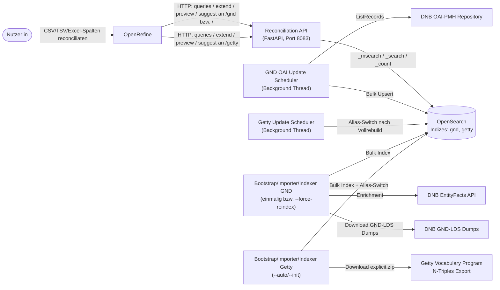
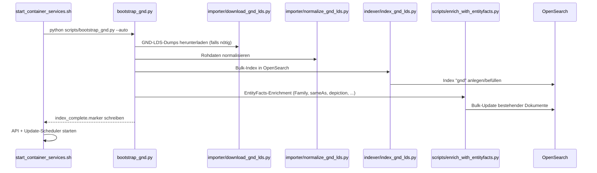
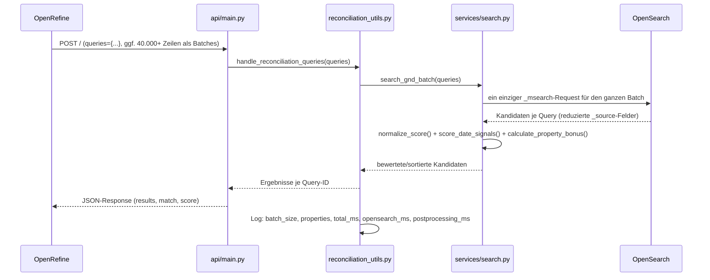
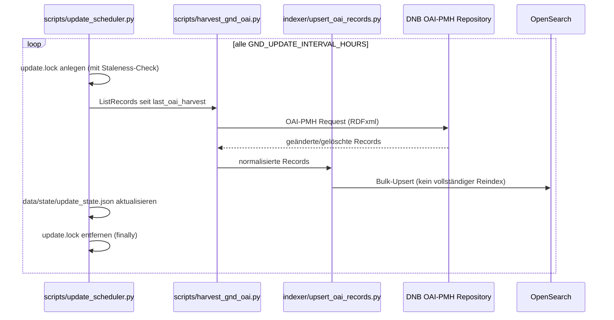
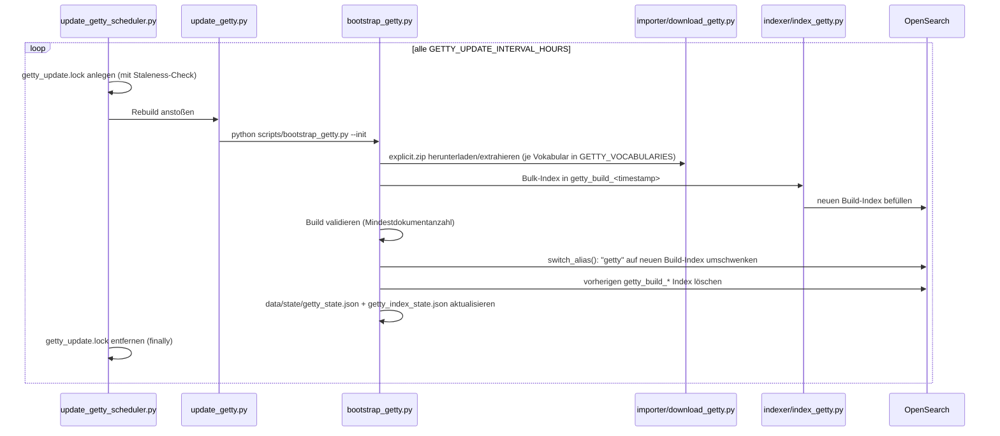

# Architektur

Dieses Dokument beschreibt den Aufbau, die Komponenten und den Datenfluss des Reconciliation-API-Projekts. Der Service stellt zwei unabhängige Vokabulare bereit: die **Gemeinsame Normdatei (GND)** unter `/gnd` (sowie, aus Gründen der Abwärtskompatibilität, weiterhin am Root-Endpunkt `/`) und die **Getty** Vokabularien unter `/getty`.

---

## Inhaltsverzeichnis

1. [Überblick](#überblick)
2. [Systemkontext](#systemkontext)
3. [Komponenten](#komponenten)
4. [Datenfluss: Bootstrap / Erstindexierung](#datenfluss-bootstrap--erstindexierung)
5. [Datenfluss: Reconciliation Query](#datenfluss-reconciliation-query)
6. [Datenfluss: Wöchentliche OAI-Updates](#datenfluss-wöchentliche-oai-updates)
7. [Getty AAT: Vokabular-Architektur und Rebuild-Datenfluss](#getty-aat-vokabular-architektur-und-rebuild-datenfluss)
8. [Persistenz](#persistenz)
9. [Deployment-Modi](#deployment-modi)
10. [Konfiguration](#konfiguration)

---

## Überblick

Der Service ist ein lokaler, Docker-basierter Reconciliation-Service. Er kombiniert:

- einen einmaligen/inkrementellen **Import- und Indexierungsprozess** je Vokabular (GND-LDS-Dumps + EntityFacts-Enrichment; Getty N-Triples-Export),
- je einen **OpenSearch-Index** als persistenten Suchindex (`gnd`, `getty`),
- eine **FastAPI-Anwendung**, die pro Vokabular eine OpenRefine-kompatible [Reconciliation API](https://reconciliation-api.github.io/specs/latest/) über eine gemeinsame Router-Factory bereitstellt,
- einen **Scheduler pro Vokabular**, der den jeweiligen Index aktuell hält (GND: inkrementell über OAI-PMH; Getty: periodischer Vollrebuild).

---

## Systemkontext

Der Service läuft vollständig lokal (Docker Compose). Externe Abhängigkeiten bestehen zur DNB (GND-LDS-Dumps, EntityFacts, OAI-PMH) sowie zum Getty Vocabulary Program (N-Triples-Export) beim erstmaligen import und den regelmäßigen Updates.

---

## Komponenten

| Komponente | Pfad | Verantwortung |
|---|---|---|
| FastAPI-App | [api/main.py](../api/main.py) | App-Setup, Mounten der Router (`/gnd` und, für Abwärtskompatibilität, zusätzlich `/` für GND; `/getty` für Getty) |
| Router-Factory | [api/routers/reconciliation.py](../api/routers/reconciliation.py) | Erzeugt aus einem `VocabConfig` einen kompletten Satz OpenRefine-Endpunkte (Manifest, Query, Suggest, Extend, Preview) – gemeinsamer Code für GND und Getty. Ein optionaler `operation_id_prefix`-Parameter erlaubt es, denselben Vokabular-Router (GND) unter mehreren Prefixes zu mounten, ohne doppelte OpenAPI-`operationId`s zu erzeugen |
| Vokabular-Konfiguration GND | [api/vocabularies/gnd.py](../api/vocabularies/gnd.py) | `GND_VOCAB`: Typen, Properties, Feldnamen, Aliase für die GND |
| Vokabular-Konfiguration Getty | [api/vocabularies/getty.py](../api/vocabularies/getty.py) | `GETTY_VOCAB`: Typen, Properties, Feldnamen für AAT, ULAN, TGN |
| Vokabular-Basistyp | [api/vocabularies/base.py](../api/vocabularies/base.py) | `VocabConfig`-Datenklasse, die beide Vokabulare implementieren |
| Konstanten/Typen | [api/constants.py](../api/constants.py), [api/gnd_types.py](../api/gnd_types.py) | GND-Entitätstypen, unterstützte Properties |
| Reconciliation-Orchestrierung | [api/reconciliation_utils.py](../api/reconciliation_utils.py) | Batch-Aufbereitung der Queries, Timing-Logs |
| OpenSearch-Integration | [api/services/search.py](../api/services/search.py) | Query-Body-Aufbau, `_msearch`-Batching, Scoring (vokabular-agnostisch über `VocabConfig`) |
| Property-Matching | [api/services/property_matching.py](../api/services/property_matching.py) | Generischer Property-Bonus/Penalty |
| Property Registry | [api/services/property_registry.py](../api/services/property_registry.py), [config/gnd_properties.json](../config/gnd_properties.json) | Bekannte GND-Properties inkl. Labels |
| Property Labels | [api/services/property_labels.py](../api/services/property_labels.py) | Auflösung von Property-IDs zu menschenlesbaren Labels |
| Extend API | [api/services/properties.py](../api/services/properties.py) | „Add columns from reconciled values" |
| Preview | [api/services/preview.py](../api/services/preview.py) | HTML-Vorschau für OpenRefine |
| Vocab Resolver | [api/services/vocab_resolver.py](../api/services/vocab_resolver.py), [config/gnd_vocab_labels.json](../config/gnd_vocab_labels.json) | Auflösung von RDF-Vokabular-URIs zu Labels (GND) |
| Zentrale Konfiguration | [config/\_\_init\_\_.py](../config/__init__.py) | Liest Environment-Variablen (`.env`), stellt Konstanten für den Rest der App bereit (GND- und Getty-Abschnitt) |
| Importer GND | [importer/download_gnd_lds.py](../importer/download_gnd_lds.py), [importer/normalize_gnd_lds.py](../importer/normalize_gnd_lds.py) | Download der GND-LDS-Dumps, Normalisierung |
| Importer Getty | [importer/download_getty.py](../importer/download_getty.py), [importer/normalize_getty.py](../importer/normalize_getty.py), [importer/getty_vocab_specs.py](../importer/getty_vocab_specs.py), [importer/ntriples.py](../importer/ntriples.py) | Download/Extraktion des N-Triples-Exports, N-Triples-Parsing, Normalisierung je Getty-Vokabular-Spezifikation |
| Indexer | [indexer/](../indexer/) | Bulk-Indexierung/Upsert in OpenSearch (`index_gnd_lds.py`, `index_entityfacts.py`, `upsert_oai_records.py` für GND; `index_getty.py` für Getty) |
| Scripts | [scripts/](../scripts/) | Bootstrap-Orchestrierung (`bootstrap_gnd.py`, `bootstrap_getty.py`), Update-Scheduler (`update_scheduler.py`, `update_getty_scheduler.py`, `update_getty.py`), gemeinsame Build-State-/Lock-Verwaltung (`index_build_state.py`), OpenSearch-Admin-Hilfsfunktionen (`opensearch_index_admin.py`), Container-Startup |

---

## Datenfluss: Bootstrap / Erstindexierung

`GND_FORCE_REINDEX=false` und ein vorhandenes `data/state/index_complete.marker` überspringen diesen kompletten Ablauf beim Container-Start (siehe [docs/ENTWICKLUNG.md](ENTWICKLUNG.md)).

---

## Datenfluss: Reconciliation Query

Wichtige Design-Entscheidung: **ein** `_msearch`-Request pro Batch statt eines `search_gnd()`-Aufrufs pro Zeile – das war der wesentliche Performance-Hebel für große OpenRefine-Batches. Details zum Scoring stehen im Abschnitt "Performance & Scoring" der [README.md](../README.md).

---

## Datenfluss: Tägliche/Wöchentliche OAI-Updates

Der Scheduler läuft als Hintergrund-Thread im selben Container wie die API (kein separater Service). `update.lock` wird als veraltet erkannt und entfernt, wenn er älter als `GND_UPDATE_LOCK_STALE_SECONDS` ist (Schutz gegen verwaiste Locks nach Container-Abbruch).

---

## Getty: Vokabular-Architektur und Rebuild-Datenfluss

Getty ist als zweites Vokabular über dieselbe Router-Factory eingebunden ([api/routers/reconciliation.py](../api/routers/reconciliation.py)): `build_reconciliation_router(GETTY_VOCAB)` erzeugt dieselben OpenRefine-Endpunkte wie für GND, nur konfiguriert über [api/vocabularies/getty.py](../api/vocabularies/getty.py) statt [api/vocabularies/gnd.py](../api/vocabularies/gnd.py), und wird in [api/main.py](../api/main.py) unter dem Prefix `/getty` gemountet. Scoring, Batching und `_msearch`-Logik in [api/services/search.py](../api/services/search.py) sind vokabular-agnostisch und werden für beide Indizes wiederverwendet.

Analog dazu wird GND selbst zweimal gemountet: einmal am Root-Endpunkt `/` (aus Gründen der Abwärtskompatibilität mit bestehenden OpenRefine-Service-Konfigurationen) und einmal unter dem eigenen Prefix `/gnd` (für Konsistenz mit `/getty`). Beide Mounts nutzen denselben `GND_VOCAB`, der `/gnd`-Mount erhält jedoch eine Kopie mit `route_prefix="/gnd"` (via `dataclasses.replace`), damit das Service-Manifest korrekt `/gnd`-präfixierte Sub-Endpunkt-URLs (Preview, Suggest, Extend) meldet, sowie einen eigenen `operation_id_prefix`, um doppelte OpenAPI-`operationId`s zwischen den beiden GND-Mounts zu vermeiden.

Da Getty keine Änderungsliste analog zu GNDs OAI-PMH bereitstellt, gibt es keinen inkrementellen Update-Pfad. Stattdessen baut jeder Rebuild einen komplett neuen Index auf und schwenkt danach die öffentliche Alias `getty` atomar um:

`scripts/bootstrap_getty.py` unterstützt außerdem `--check-only` (rein lesend, kein Schreibzugriff auf State oder Index) und `--auto` (führt nur dann einen Vollbuild aus, wenn noch kein vollständiger, konsistenter Getty-Index vorhanden ist – inklusive einmaliger Adoption eines bereits bestehenden, gesunden `getty`-Index ohne Neuaufbau). Die Alias-Switch-Logik in `scripts/opensearch_index_admin.py` (`switch_alias()`) behandelt dabei auch den Sonderfall, dass `getty` initial noch ein einfacher konkreter Index ist statt einer Alias, und migriert ihn transparent auf das Alias-Pattern.

`scripts/index_build_state.py` verwaltet Build-State und Locks für beide Vokabulare gemeinsam über einen `vocab`-Parameter: GND behält dabei die ursprünglichen, unpräfigierten Dateinamen (`index_state.json`, `index_build.lock`), Getty erhält präfigierte Namen (`getty_index_state.json`, `getty_index_build.lock`), um Kollisionen zu vermeiden.

---

## Persistenz

| Pfad | Inhalt | Git-Status |
|---|---|---|
| `data/raw/` | Heruntergeladene GND-LDS- und EntityFacts-Dumps | ignoriert |
| `data/raw/getty/` | Heruntergeladener/extrahierter Getty-N-Triples-Export (`explicit.zip` + `.nt`-Dateien) | ignoriert |
| `data/processed/` | Normalisierte Zwischendaten | ignoriert |
| `data/state/` | Bootstrap-/Update-/Lock-Status für GND (`index_state.json`, `update_state.json`, `*.lock`, `*.marker`) und Getty (`getty_state.json`, `getty_index_state.json`, `getty_*.lock`) | ignoriert |
| `data/logs/` | Anwendungs- und Scheduler-Logs (u.a. `bootstrap_gnd.log`, `bootstrap_getty.log`, `update_scheduler.log`, `update_getty_scheduler.log`) | ignoriert |
| `data/opensearch/` bzw. OpenSearch Docker Volume | Eigentliche Suchindizes `gnd` und `getty` (Getty über eine Alias auf `getty_build_<timestamp>`) | Volume, nicht in Git |
| `config/gnd_properties.json`, `config/gnd_vocab_labels.json` | Gecachte Registries/Labels | versioniert |

Runtime- und DevContainer-Modus teilen sich dasselbe OpenSearch-Volume (`local_reconciliation_api_opensearch-data`) – beide dürfen nicht gleichzeitig laufen.

---

## Deployment-Modi

- **Production/Runtime** ([docker-compose.runtime.yml](../docker-compose.runtime.yml), [Dockerfile](../Dockerfile)): Multi-Stage-Build, Code wird ins Image kopiert, minimaler Footprint, Healthcheck gegen `/status/update`.
- **DevContainer** ([.devcontainer/](../.devcontainer/)): Workspace live gemountet, Hot-Reload via `uvicorn --reload`, zusätzliche Entwickler-Tools.

Details und Umschaltprozess: [docs/ENTWICKLUNG.md](ENTWICKLUNG.md) sowie [.devcontainer/README.md](../.devcontainer/README.md).

---

## Konfiguration

Sämtliche Environment-Variablen (OpenSearch-Verbindung, Update-Intervalle, OAI-Endpunkt, Ports) werden zentral in [config/\_\_init\_\_.py](../config/__init__.py) aus `.env` gelesen und von dort in den Rest der Anwendung importiert – siehe `.env.example` für die vollständige Liste mit Standardwerten.
