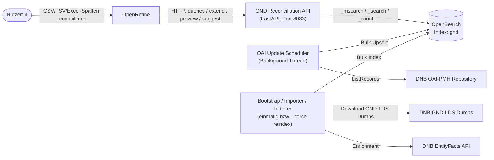
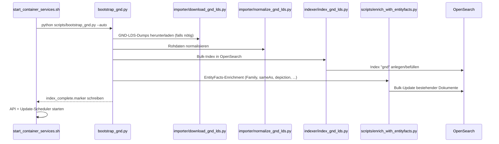
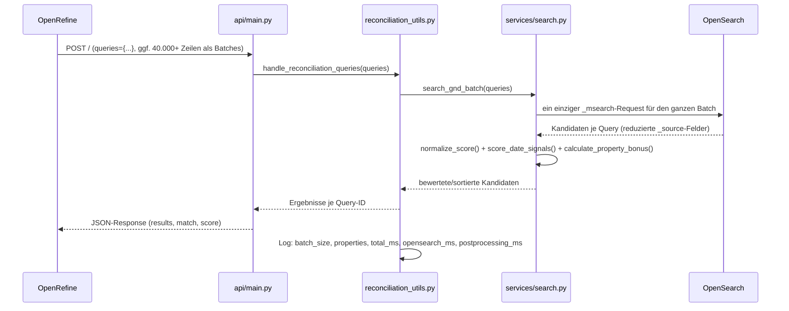
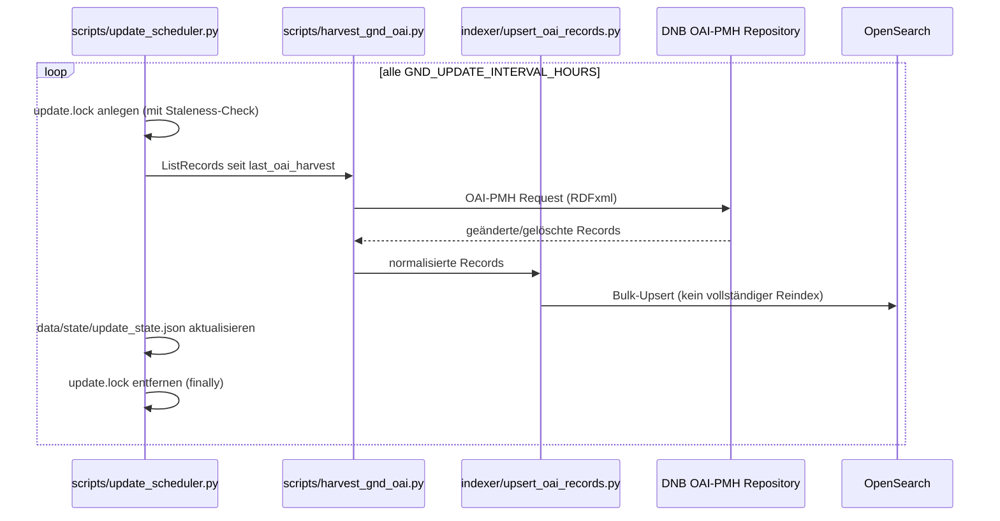

# Architektur

Dieses Dokument beschreibt den Aufbau, die Komponenten und den Datenfluss des GND Reconciliation API Projekts.

---

## Inhaltsverzeichnis

1. [Überblick](#überblick)
2. [Systemkontext](#systemkontext)
3. [Komponenten](#komponenten)
4. [Datenfluss: Bootstrap / Erstindexierung](#datenfluss-bootstrap--erstindexierung)
5. [Datenfluss: Reconciliation Query](#datenfluss-reconciliation-query)
6. [Datenfluss: Wöchentliche OAI-Updates](#datenfluss-wöchentliche-oai-updates)
7. [Persistenz](#persistenz)
8. [Deployment-Modi](#deployment-modi)
9. [Konfiguration](#konfiguration)

---

## Überblick

Der Service ist ein lokaler, Docker-basierter Reconciliation-Service für die **Gemeinsame Normdatei (GND)**. Er kombiniert:

- einen einmaligen/inkrementellen **Import- und Indexierungsprozess** (GND-LDS-Dumps + EntityFacts-Enrichment),
- einen **OpenSearch-Index** als persistenten Suchindex,
- eine **FastAPI-Anwendung**, die eine OpenRefine-kompatible [Reconciliation API](https://reconciliation-api.github.io/specs/latest/) bereitstellt,
- einen **Scheduler**, der den Index über OAI-PMH inkrementell aktuell hält.

---

## Systemkontext

Der Service läuft vollständig lokal (Docker Compose). Externe Abhängigkeiten bestehen nur zur DNB (GND-LDS-Dumps, EntityFacts, OAI-PMH), nicht zu Drittanbietern.

---

## Komponenten

| Komponente | Pfad | Verantwortung |
|---|---|---|
| FastAPI-App | [api/main.py](../api/main.py) | Route-Definitionen, Service-Manifest, Request-Dispatch |
| Konstanten/Typen | [api/constants.py](../api/constants.py), [api/gnd_types.py](../api/gnd_types.py) | GND-Entitätstypen, unterstützte Properties |
| Reconciliation-Orchestrierung | [api/reconciliation_utils.py](../api/reconciliation_utils.py) | Batch-Aufbereitung der Queries, Timing-Logs |
| OpenSearch-Integration | [api/services/search.py](../api/services/search.py) | Query-Body-Aufbau, `_msearch`-Batching, Scoring |
| Property-Matching | [api/services/property_matching.py](../api/services/property_matching.py) | Generischer Property-Bonus/Penalty |
| Property Registry | [api/services/property_registry.py](../api/services/property_registry.py), [config/gnd_properties.json](../config/gnd_properties.json) | Bekannte GND-Properties inkl. Labels |
| Property Labels | [api/services/property_labels.py](../api/services/property_labels.py) | Auflösung von Property-IDs zu menschenlesbaren Labels |
| Extend API | [api/services/properties.py](../api/services/properties.py) | „Add columns from reconciled values" |
| Preview | [api/services/preview.py](../api/services/preview.py) | HTML-Vorschau für OpenRefine |
| Vocab Resolver | [api/services/vocab_resolver.py](../api/services/vocab_resolver.py), [config/gnd_vocab_labels.json](../config/gnd_vocab_labels.json) | Auflösung von RDF-Vokabular-URIs zu Labels |
| Zentrale Konfiguration | [config/\_\_init\_\_.py](../config/__init__.py) | Liest Environment-Variablen (`.env`), stellt Konstanten für den Rest der App bereit |
| Importer | [importer/](../importer/) | Download der GND-LDS-Dumps, Normalisierung (GND-LDS + EntityFacts) |
| Indexer | [indexer/](../indexer/) | Bulk-Indexierung/Upsert in OpenSearch |
| Scripts | [scripts/](../scripts/) | Bootstrap-Orchestrierung, OAI-Harvesting, Update-Scheduler, Container-Startup |

---

## Datenfluss: Bootstrap / Erstindexierung

`GND_FORCE_REINDEX=false` und ein vorhandenes `data/state/index_complete.marker` überspringen diesen kompletten Ablauf beim Container-Start (siehe [docs/ENTWICKLUNG.md](ENTWICKLUNG.md)).

---

## Datenfluss: Reconciliation Query

Wichtige Design-Entscheidung: **ein** `_msearch`-Request pro Batch statt eines `search_gnd()`-Aufrufs pro Zeile – das war der wesentliche Performance-Hebel für große OpenRefine-Batches. Details zum Scoring stehen im Abschnitt "Performance & Scoring" der [README.md](../README.md).

---

## Datenfluss: Tägliche/Wöchentliche OAI-Updates

Der Scheduler läuft als Hintergrund-Thread im selben Container wie die API (kein separater Service). `update.lock` wird als veraltet erkannt und entfernt, wenn er älter als `GND_UPDATE_LOCK_STALE_SECONDS` ist (Schutz gegen verwaiste Locks nach Container-Abbruch).

---

## Persistenz

| Pfad | Inhalt | Git-Status |
|---|---|---|
| `data/raw/` | Heruntergeladene GND-LDS- und EntityFacts-Dumps | ignoriert |
| `data/processed/` | Normalisierte Zwischendaten | ignoriert |
| `data/state/` | Bootstrap-/Update-/Lock-Status (`index_state.json`, `update_state.json`, `*.lock`, `*.marker`) | ignoriert |
| `data/logs/` | Anwendungs- und Scheduler-Logs | ignoriert |
| `data/opensearch/` bzw. OpenSearch Docker Volume | Eigentlicher Suchindex | Volume, nicht in Git |
| `config/gnd_properties.json`, `config/gnd_vocab_labels.json` | Gecachte Registries/Labels | versioniert |

Runtime- und DevContainer-Modus teilen sich dasselbe OpenSearch-Volume (`local_reconciliation_api_opensearch-data`) – beide dürfen nicht gleichzeitig laufen.

---

## Deployment-Modi

- **Production/Runtime** ([docker-compose.runtime.yml](../docker-compose.runtime.yml), [Dockerfile](../Dockerfile)): Multi-Stage-Build, Code wird ins Image kopiert, minimaler Footprint, Healthcheck gegen `/status/update`.
- **DevContainer** ([.devcontainer/](../.devcontainer/)): Workspace live gemountet, Hot-Reload via `uvicorn --reload`, zusätzliche Entwickler-Tools.

Details und Umschaltprozess: [docs/ENTWICKLUNG.md](ENTWICKLUNG.md) sowie [.devcontainer/README.md](../.devcontainer/README.md).

---

## Konfiguration

Sämtliche Environment-Variablen (OpenSearch-Verbindung, Update-Intervalle, OAI-Endpunkt, Ports) werden zentral in [config/\_\_init\_\_.py](../config/__init__.py) aus `.env` gelesen und von dort in den Rest der Anwendung importiert – siehe `.env.example` für die vollständige Liste mit Standardwerten.
